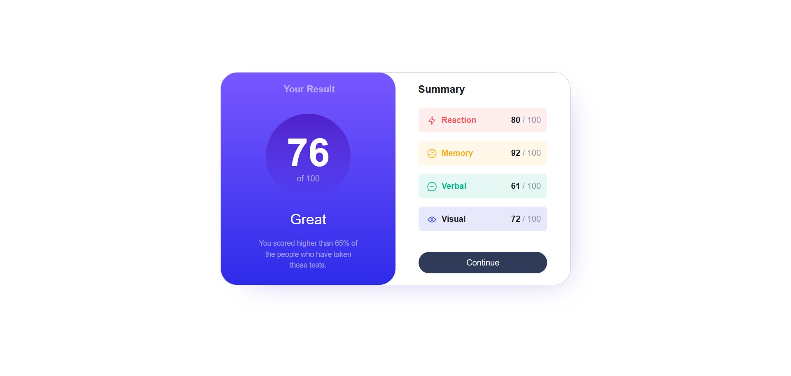
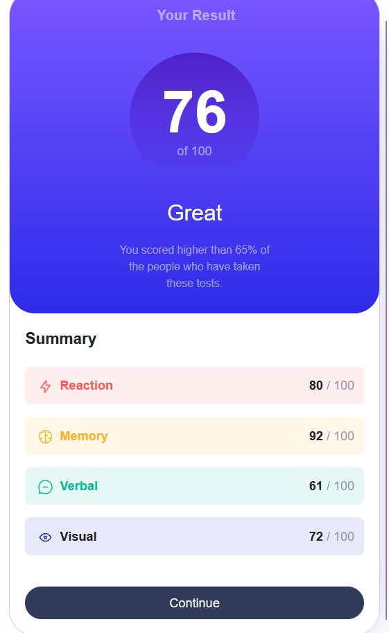

# Frontend Mentor - Results summary component solution

This is a solution to the [Results summary component challenge on Frontend Mentor](https://www.frontendmentor.io/challenges/results-summary-component-CE_K6s0maV). Frontend Mentor challenges help you improve your coding skills by building realistic projects.

## Table of contents

- [Overview](#overview)
  - [The challenge](#the-challenge)
  - [Screenshot](#screenshot)
  - [Links](#links)
- [My process](#my-process)
  - [Built with](#built-with)
  - [What I learned](#what-i-learned)
  - [Continued development](#continued-development)
  - [Useful resources](#useful-resources)
- [Author](#author)
- [Acknowledgments](#acknowledgments)

## Overview

### The challenge

Users should be able to:

- View the optimal layout for the interface depending on their device's screen size
- See hover and focus states for all interactive elements on the page

### Screenshot

- Desktop version.
  

- Mobile version.
  

### Links

- Solution URL: [Bootstrap](https://getbootstrap.com/)
- Live Site URL: (https://results-summary-component-liart-nine.vercel.app/)

## My process

### Built with

- [Bootstrap](https://getbootstrap.com/)
- Card from [Bootstrap](https://getbootstrap.com/)
- CSS custom properties
- Flexbox
- Float
- Media queries

### What I learned

When i made this project, i got problems with centering the element card in the middle of the page and also with the responsive page when i use mobile device's width and the desktop's width, so i solve it with media screen so the css effect will work based on the width of the device, weather it's mobile or desktop. Although it still has some differences with the design but i'm confident with just this result.

```html
<h1>Some code I'm proud of</h1>
```

```css
/* media screen */
@media (min-width: 375px) {
  .card .row .your-result {
    margin-top: 15px;
  }
}

@media (min-width: 768px) {
  .container {
    margin-top: 140px;
  }
}
```

### Continued development

For more update in the future, because i'm still learning javascript right now, i might use the json file with JQuery instead of writing it down manually later.

### Useful resources

- [Bootstrap](https://getbootstrap.com/) - This helped me to do the styling more easy. I really liked this bootstrap and will use it going forward.
- [Vercel](https://vercel.com) - This is an amazing website which helped me to deploy my website into the internet. I'd recommend it to anyone still learning to use this website.

## Author

- Website - [AbalJerind](https://qr-code-main-three.vercel.app/)
- Frontend Mentor - [@Abaljerind](https://www.frontendmentor.io/profile/Abaljerind)
- LinkedIn - [AbalJerind](https://www.linkedin.com/in/abal-jerind-baa90519a/)

## Acknowledgments

I want to thank me for believing in me, I want to thank me for doing all this hard work. I wanna thank me for having no days off. I wanna thank me for never quitting. I wanna thank me for being me at all times.
